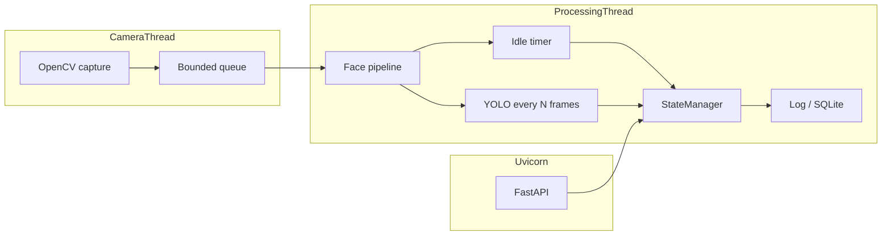

# Heartbeat AI — Project Documentation

This document describes the **Heartbeat AI** office monitoring service: goals, architecture, modules, configuration, and operations. For quick install and commands, see [README.md](README.md).

---

## 1. Purpose

Heartbeat AI runs on a laptop (typically in the background) and:

1. **Presence** — Decides whether someone is in front of the PC using webcam face detection.
2. **Headcount** — Counts faces (0, 1, or multiple) for policy and security signals.
3. **Device risk** — Detects **cell phone** / **tablet**-like objects with YOLOv8 (periodically, to save CPU).
4. **Idle / absence** — Tracks how long the user has been away (debounced “no face” window).
5. **Integration** — Exposes a small **HTTP API** (FastAPI) so other systems (e.g. a .NET heartbeat client) can poll status.

Optional **SQLite** logging records throttled snapshots of state for auditing or analytics.

---

## 2. High-Level Architecture

The system uses **three concurrent paths**:

| Thread | Role |
|--------|------|
| **Camera** | Captures BGR frames from OpenCV, targets configured resolution, reconnects on failure, pushes into a **bounded queue** (default max 5; oldest dropped if full). |
| **Processing** | Dequeues frames, runs face pipeline, runs YOLO every *N* frames, updates idle logic and **thread-safe state**, writes logs / optional DB rows, draws preview if enabled. |
| **API** (optional) | **Uvicorn** + FastAPI serve `GET /status` and `GET /health` (skipped in `--visual`-only mode). |

**State** is centralized in `StateManager` (lock-protected) so the API and processing loop never corrupt shared fields.

---

## 3. Face Detection Pipeline (Upgrade Path)

Faces are detected in **strict priority order**:

1. **MediaPipe BlazeFace** (`FaceDetection`, short-range / `model_selection=0`) when the real Google **MediaPipe** package imports correctly. Provides multiple faces and reasonable angles; exposes per-detection **scores** for the UI.

2. **OpenCV YuNet** (`cv2.FaceDetectorYN`) when MediaPipe is missing or broken. Uses the ONNX model **`face_detection_yunet_2023mar.onnx`** from the [OpenCV Zoo](https://github.com/opencv/opencv_zoo). On first use, the app can **download** the file into `heartbeat_ai/models/`. YuNet is much stronger than Haar for **multiple faces** and varied poses.

3. **OpenCV Haar cascade** (`haarcascade_frontalface_default.xml`) as a last resort (offline / very old OpenCV / download failure). Uses `detectMultiScale3` **level weights** for pseudo-confidence, **NMS** to merge duplicate boxes on one face, and is weaker for partial or secondary faces.

The active backend name is available in logs and in the visual HUD as **`Face engine:`** (`mediapipe`, `opencv_yunet`, or `opencv_haar`).

**Environment override:** set `HEARTBEAT_YUNET_PATH` to a full path of a local YuNet `.onnx` file to skip the default path / auto-download location.

---

## 4. Phone / Tablet Detection

- **Model:** Ultralytics **YOLOv8n** (default `yolov8n.pt` under `heartbeat_ai/`, downloaded on first run by Ultralytics).
- **Classes:** COCO includes **cell phone**; **tablet** is not a standard COCO class. The code matches class names whose text contains configured substrings (e.g. `cell phone`, `phone`, `tablet`). For reliable tablets, use **custom weights** and set `yolo_model_path` in config.
- **Performance:** Inference runs only every **`yolo_every_n_frames`** (default 10). Frames are resized before inference (`yolo_infer_max_side`, default 416).
- **Lazy load:** Torch / Ultralytics are imported on first use so a broken NumPy/Torch install does not crash process startup immediately (see troubleshooting).

---

## 5. Presence, Idle, and Status Strings

- **Present:** `face_count >= 1` immediately marks the user as present (after idle logic sees a face again).
- **Absent debounce:** If `face_count == 0` continuously for **`absence_buffer_sec`** (default 5 seconds), the user is marked absent. This avoids flicker from brief detection drops.
- **Idle duration:** When the user returns after a debounced absence, the time away is computed and logged (spurious “first ever face” idle is avoided when no face was ever seen).
- **Status examples:** `No User`, `Single User`, `Multiple Users (HIGH RISK)` (when `high_risk_on_multi_user` is true), with optional suffix `| PHONE DETECTED`.

---

## 6. Module Reference (`app/`)

| Module | Responsibility |
|--------|----------------|
| `run.py` (package root) | CLI, `sys.path` bootstrap, starts camera + processing + optional Uvicorn; flags `--debug`, `--visual`, `--host`, `--port`. |
| `main.py` | `MonitorService`: queue consumer loop, wires detectors, preview drawing (boxes, confidence badges, HUD). |
| `camera.py` | `CameraThread`: 640×480 (or config), retries, health callback. |
| `presence.py` | MediaPipe → YuNet → Haar; `configure_presence(settings)`; `detect_faces`, `face_backend`, NMS for Haar, YuNet download. |
| `phone_detector.py` | `PhoneDetector`, `PhoneBox`, `detect_phones`, lazy YOLO load. |
| `idle_timer.py` | Debounced presence and idle duration. |
| `state_manager.py` | Locked snapshot for API and logic. |
| `frame_queue.py` | Bounded queue with drop-oldest policy. |
| `api.py` | FastAPI app: `/status`, `/health`. |
| `logger.py` | File + optional console logging; `log_event` for structured lines. |
| `database.py` | SQLite `events` table; throttled inserts. |
| `config.py` | `Settings` dataclass: camera, queue, absence buffer, YuNet, YOLO, API, paths, DB throttle. |

---

## 7. Configuration

All defaults are in [`app/config.py`](app/config.py). Notable fields:

- **Camera:** `camera_index`, `frame_width`, `frame_height`, queue size, reconnect/backoff.
- **Idle:** `absence_buffer_sec`.
- **YuNet:** `yunet_onnx_name`, `yunet_score_threshold`, `yunet_nms_threshold`; ONNX stored under `heartbeat_ai/models/`.
- **YOLO:** `yolo_model_path`, `yolo_every_n_frames`, `yolo_infer_max_side`, target name substrings.
- **API:** `api_host`, `api_port` (default loopback).
- **Persistence:** `log_file`, `sqlite_db`, `db_insert_min_interval_sec`.

**Environment variables** (see `settings_from_env()`): `HEARTBEAT_CAMERA_INDEX`, `HEARTBEAT_API_HOST`, `HEARTBEAT_API_PORT`, `HEARTBEAT_ABSENCE_BUFFER_SEC`, plus **`HEARTBEAT_YUNET_PATH`** for a custom YuNet ONNX path.

---

## 8. HTTP API

| Method | Path | Description |
|--------|------|-------------|
| GET | `/status` | JSON: `face_count`, `is_present`, `phone_detected`, `status`, `last_updated` (Unix time). |
| GET | `/health` | JSON: `ok`, `camera_ok`. |

With **`--visual`**, the HTTP server is **not** started; use default mode or `--debug` for API + window.

---

## 9. CLI Modes

| Flag | Behavior |
|------|----------|
| *(none)* | Background service + API; no OpenCV window. |
| `--debug` | API + OpenCV preview window (`heartbeat_debug`). |
| `--visual` | Preview only (`heartbeat_live`); **no** FastAPI; good for demos. |

Press **Q** in the preview window (with focus) or **Ctrl+C** in the terminal to stop.

---

## 10. Logs and Database

- **`heartbeat.log`** — Under `heartbeat_ai/`; startup, business events (absent/return, multiple users, phone, idle), and errors.
- **`events.db`** — SQLite; table `events` with timestamp, `face_count`, `phone_detected`, `status`; inserts are **throttled** to avoid disk spam.

---

## 11. Dependencies

See [`requirements.txt`](requirements.txt). Important constraints:

- **Python 3.10+**
- **NumPy 1.x** (`numpy>=1.26.2,<2`) — many PyTorch wheels still conflict with NumPy 2.x.
- **OpenCV &lt; 4.12** in requirements — aligns with NumPy 1.x; OpenCV 4.12+ often wants NumPy 2.
- **MediaPipe** — Use the official Google package; a broken or wrong install shows missing `solutions` / `face_detection`; the app then uses YuNet or Haar.

First-run artifacts:

- `yolov8n.pt` (Ultralytics)
- `face_detection_yunet_2023mar.onnx` (YuNet, if MediaPipe fails and download succeeds)

---

## 12. Troubleshooting (Short)

| Symptom | Likely cause | Action |
|---------|----------------|--------|
| `Numpy is not available` / YOLO disabled | NumPy 2.x vs old Torch | `pip install "numpy>=1.26.2,<2"`; align OpenCV per requirements. |
| MediaPipe has no `solutions` | Wrong/corrupt install | `pip uninstall mediapipe -y` then `pip install "mediapipe>=0.10.14,<0.11"`; remove any local `mediapipe.py`. |
| Only one face with Haar | Cascade limitations | Ensure YuNet downloads; fix MediaPipe for best quality. |
| YuNet never loads | No network / blocked | Set `HEARTBEAT_YUNET_PATH` to a manually downloaded ONNX. |

---

## 13. Packaging (PyInstaller)

See [README.md](README.md) for `pyinstaller --onefile --noconsole` and optional `--collect-all mediapipe ultralytics`. Ensure the packaged app can find `heartbeat_ai`, models, and weights (paths / `PYTHONPATH`).

---

## 14. Security Note

The API defaults to **127.0.0.1**. Do not expose it on untrusted networks without authentication and TLS.

---

*Document version: aligned with the `heartbeat_ai` package layout under the repository root.*
